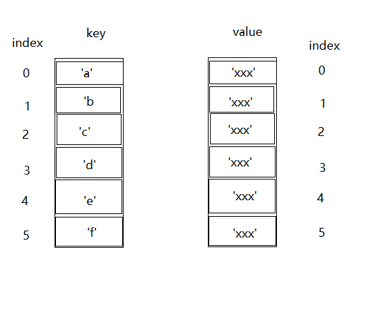

# WeakMap
```WeakMap```是ES6提供的一个原生的数据结构。  
```WeakMap``` 对象是一组键/值对的集合，其中键是弱引用。其键必须是对象，而值可以是任意的。（from [MDN](https://developer.mozilla.org/zh-CN/docs/Web/JavaScript/Reference/Global_Objects/WeakMap)）  
## Map 与 WeakMap
* Map API可以通过使其四个API方法共用两个数组（一个存放key，一个存放value）来实现。给map set值时会将key和value添加到这两个数组的末尾，从而使得key和value的索引在两个数组中相对应。  
  
从map中取值时，需要遍历所有的key，然后根据找到key的索引从存储value的数组中取出相应的value。这个实现的缺点很大，首先赋值和搜索的时间复杂度为O(n)；其次是可能导致内存溢出的，因为如果键是一个对象的话，那数组会一直保存这个对象的引用，这种引用使得垃圾回收算法不能回收处理他们，即使没有其他任何引用存在了。
* 原生的 ```WeakMap``` 持有的是每个键对象的“弱引用”，这意味着在没有其他引用存在时垃圾回收能正确进行。原生 ```WeakMap``` 的结构是特殊且有效的，其用于映射的 key 只有在其没有被回收时才是有效的。我们看下```WeakMap```的实现代码：  
  ```js
  var WeakMap = function() {
    this.name = '__wm__' + uuid()
  };

  WeakMap.prototype = {
    set: function(key, value) {
      Object.defineProperty(key, this.name, {
          value: [key, value],
      });
      return this;
    },
    get: function(key) {
      var entry = key[this.name];
      return (entry && entry[0] === key) ? entry[1] : undefined;
    },
    ...
  };
  ```
  它没有使用任何的数组，```weakmap.set(key, value)```是通过 ```Obejct.defineProperty()``` 给 ```key``` 添加了一个新属性 ```this.name``` ，这也是为什么WeakMap中的key必须是Object了；同理，```weakmap.get(key)```是从key的该属性中获取了value。相比Map，WealMap持有的只是每个键对象的“弱引用”，不会额外开内存来保存键值引用。这就意味着没有其他引用存在时，垃圾回收器能正常处理key指向的内存块。正因为这个特殊的实现，WeakMap的key是不可枚举的。  

* 如果我们需要存储的键值对的键是一个对象且非常庞大时，使用Map会对内存造成非常大的额外消耗，而且我们需要手动清除Map的属性才能释放这块内存，而WeakMap会帮我们很大的解决这个问题。
