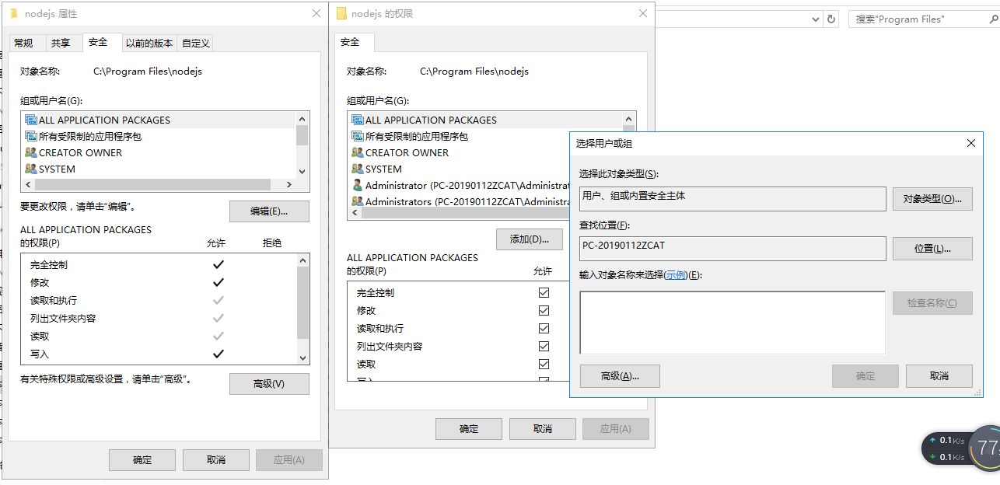
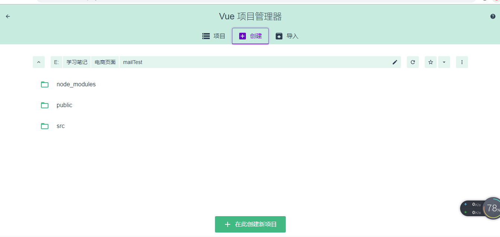

# VueCli4.0安装
## 步骤
1. 安装 ```npm i -g @vue/cli```
2. 查看版本 ```vue --version```  
3. [官方文档](https://cli.vuejs.org/guide/installation.html)

## 遇到的问题
安装时出现权限不够的问题，报错信息如下：
```
$ npm install -g @vue/cli
Unhandled rejection Error: EPERM: operation not permitted, open 'C:\Program Files\nodejs\node_cache\_cacache\tmp\49e93e22'
npm ERR! cb() never called!
```
### 解决方法
1. 以管理员的身份打开cmd，使用win+x,选择命令提示符（管理员），在里面运行命令。
2. 找到nodejs的安装目录，给当前登录用户添加权限。


# 初始化Vue项目
## 通过命令行创建
1. 创建项目 ```vue create <projectName>```
2. 进入该项目的文件夹下 ```cd projectName```
3. 运行项目 ```npm run serve```

## 通过脚手架的可视化界面创建
1. 启动可视化系统 ```vue ui```
2. 创建新项目

3. 配置项目的基本信息
