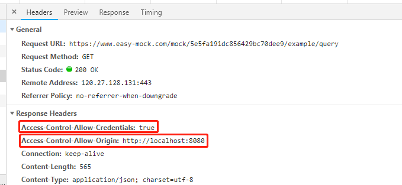
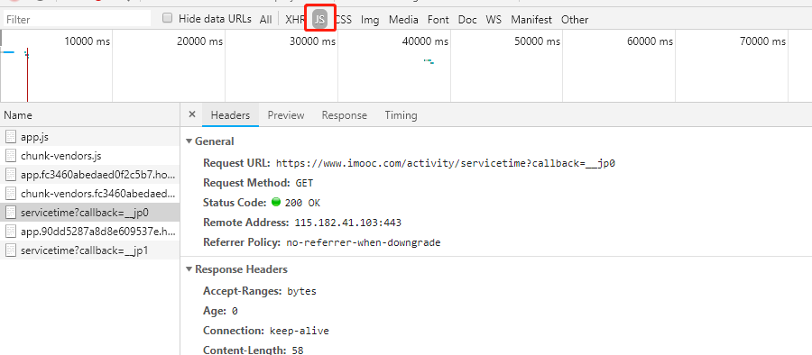
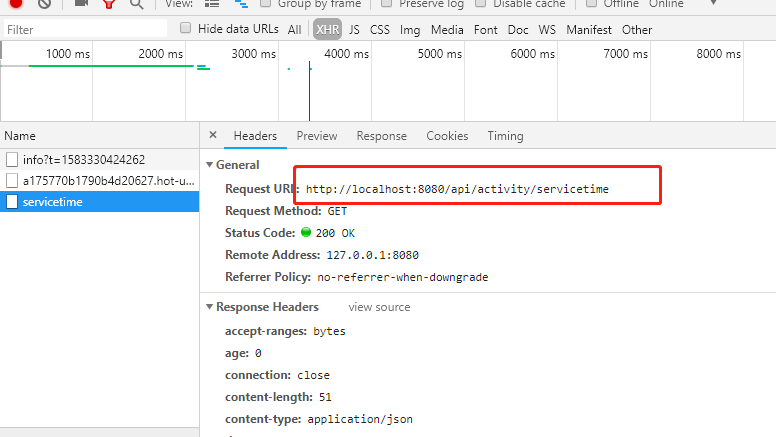

## 1. 前端跨域解决方案
### 什么是跨域
* 跨域是浏览器为了安全而做出的限制策略，属于浏览器行为，所以后端不存在跨域问题。
* 浏览器请求必须遵循同源策略：同协议、同域名、同端口。

### 跨域解决方案
#### CORS跨域
服务端设置，允许前端某个站点进行访问，前端直接调用，如下请求：  
* **Access-Control-Allow-Origin**表示允许访问的源，当前api没有做限制，任何人都可以访问，这里是动态获取的。如果Access-Control-Allow-Origin为www.baidu.com,那么我们就访问不了了。 
* **Access-Control-Allow-Credentials**是可以可以携带信用凭证，这里为true表示跨域的时候可以将cookie传过去。


#### JSONP跨域
前端安装JSONP插件，后端需要做适配，JSONP会发送一个callback的参数到后端，后端需要在callback中写入数据。  
JSONP不是一个真正的请求，是一段js脚本
``` js
let jsonpUrl = 'https://www.imooc.com/activity/servicetime'
    jsonp(jsonpUrl, (err, res) => {
      console.log(res)
    })
```

#### 代理跨域
接口代理，通过修改nginx服务器配置来实现。  
在本地开发，我们是nodejs服务器不是nginx服务器，所以我们需要通过**vue.config.js**来设置代理，**vue.config.js**是webpack的配置表，webpack配置表最终会传送给nodejs服务器来实现服务的设置。
```js
module.exports = {
	devServer: {
		host: 'localhost', // 主机
		port: 8080, // 端口号
		proxy: {
			'/api': { // 代理前缀为/api的请求
				target: 'https://www.imooc.com', // 代理的目标url地址
				changeOrigin: true, // 是否将主机源点改为目标url地址
				pathRewrite: { // 重写路径， 将/api替换为''
					'/api': ''
				}
			}
		}
	}
}
```
```js
// 发送请求，请求的完整路径为https://www.imooc.com/activity/servicetime
let url = '/api/activity/servicetime'
axios.get(url).then((resp) => {
	console.log(resp)
})
```
**/api**的请求会被代理，目标地址为**https://www.imooc.com**，并且将/api替换为空字符串，**则api路径为**https://www.imooc.com/activity/servicetime**。  
  
部署到线上的时候，就要修改nginx配置来做反向代理。