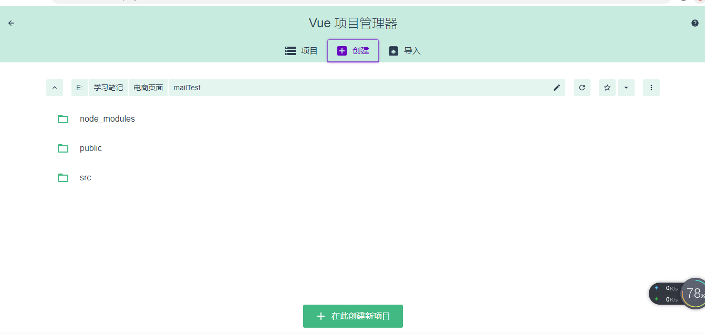

# Vue.js
## 1. 初始化vue项目
1. ```npm install -g vue-cli```       全局安装vue脚手架
2. ```vue init webpack my-project```  初始化vue项目
3. ```npm install```                  安装项目依赖，把package.json需要的依赖 安装到 node_modules
4. ```npm run dev```

> vue3.0以上版本**Vue CLI**的包名称由 ```vue-cli``` 改成 ```@vue/cli``` 。如果全局安装了旧版本的```vue-cli```(1.x或2.x)，你需要先通过 ```npm uninstall vue-cli -g``` 卸载它。  
* 安装新版本的Vue CLI并初始化项目  
  * ```npm install -g @vue/cli```
  * ```vue create myproject```


## 2. vue的两种代码模式compiler和runtime
vue升级到2.0之后可能出现的报错信息
> [Vue warn]: You are using the runtime-only build of Vue where the template compiler is not available. Either pre-compile the templates into render functions, or use the compiler-included build.
### 原因
* vue有两种形式的代码complier(模板)模式和runtime(运行时)模式，vue模板的package.json的main字段默认为runtime模式，指向了“dist/vue.runtime.common.js”位置。  
* 在main.js文件中，初始化vue代码如下所示，这种形式为complier模式的
```js
// complier
new Vue({
  el: '#app',
  router,
  components: { App },
  template: '<App/>'
})
```
### 解决方法
#### 方法一
* 修改main.js文件中初始化vue代码为runtime模式，代码如下：
```js
// runtime
new Vue({
  el: '#app',
  render: h => h(App)
})
```
#### 方法二
* 在webpack.base.conf.js文件中加上vue的别名配置，代码如下
```js
resolve: {
    extensions: ['.js', '.vue', '.json'],
    alias: {
      'vue$': 'vue/dist/vue.esm.js', //内部为正则表达式  vue结尾的
      '@': resolve('src'),
    }
  },
```
在main.js中```import Vue from 'vue'```引用的是vue/dist/vue.esm.js，直接指定了文件的位置，没有使用main字段默认的文件位置，使用的是complier模式。

## 3. VueCli4.0安装
### 步骤
1. 安装 ```npm i -g @vue/cli```
2. 查看版本 ```vue --version```  
3. [官方文档](https://cli.vuejs.org/guide/installation.html)

### 遇到的问题
安装时出现权限不够的问题，报错信息如下：
```
$ npm install -g @vue/cli
Unhandled rejection Error: EPERM: operation not permitted, open 'C:\Program Files\nodejs\node_cache\_cacache\tmp\49e93e22'
npm ERR! cb() never called!
```
#### 解决方法
1. 以管理员的身份打开cmd，使用win+x,选择命令提示符（管理员），在里面运行命令。
2. 找到nodejs的安装目录，给当前登录用户添加权限。


## 4. 初始化Vue项目
### 通过命令行创建
1. 创建项目 ```vue create <projectName>```
2. 进入该项目的文件夹下 ```cd projectName```
3. 运行项目 ```npm run serve```

### 通过脚手架的可视化界面创建
1. 启动可视化系统 ```vue ui```
2. 创建新项目

3. 配置项目的基本信息


## 5. 安装Vue-DevTools调试工具
安装**vue-devtools**在开发模式下方便前端调试  
### 方式一
通过谷歌应用商店安装 - vue devtools
### 方式二
手动安装 - [git地址](https://github.com/vuejs/vue-devtools)  
* 通过git克隆项目到本地，建议克隆master分支的代码，比较稳定。
``` 
git clone https://github.com/vuejs/vue-devtools.git -b master
```
* 运行 ```npm install```安装项目依赖，安装时间可能比较长。
* 运行```npm run build```进行打包，会生成shells文件夹，其中包含了扩展程序。
* 将扩展程序添加到chrome浏览器，打开浏览器扩展程序（在地址栏输入chrome://extensions/），点击**加载已解压的扩展程序**按钮，选择上一步生成的**shells**文件夹下的**chrome**文件夹。

